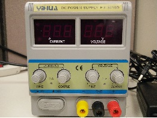

# MRAM Explore

This experiment series is the collection of experiments that explore the MRAM usage. Following section defines the experiments one by one. New contents will be added as the experiment progresses. The MRAM chip used for all of these experiments are [MRAM Click](https://download.mikroe.com/documents/datasheets/EST02896_MR25H256A_Datasheet_Rev1.0%20100116-1036068.pdf) which is sold on a nice interfacing circuit board at this [site](https://www.mikroe.com/mram-click). The chip is already equipped with SPI interfacing circuitary, making it compatible with all the microcontrollers available. Please find the codes for interfacing using ARDUINO at this github [link](https://github.com/prawarpoudel/spiMemoryChips).

The MRAM Chip comes with a really easy to use bed that can be mounted on the Arduino for interfacing. The following figures show our setup. Here we are not connecting to the bed, but rather we make an external connection so that we can play around with the connections.

 

## First Experiment

The first experiment that was performed was  just a simple traversing through the MRAM memory. The way how it operates is, it first writes 0x00 in entire memory of the MRAM, and reads the content of all the memory. While reading all the contents are checked with 0x00 to see if the writing operation was successful. Similar operation is done with writing 0xff to the memory locations well. If the content read from any memory location is not equal to either 0x00 in the first sequence of reading or 0xff in the second sequence of reading, it prints out message saying the content at certain location is not what it should be.

Following image shows the output on serial terminal when any read value is not what  it is supposed to be.

Following image shows the output printed in serial terminal when the operation is successful. The code can be found inside **expt1_18Dec/simpleTraverseMRAM**

## Second Experiment

We will continue with the same experimental code to explore the stability of the MRAM chip. Our goal is to induce perturbation in the memory cells. There have been previous experiments where researchers have controlled voltage pulses for inducing perturbation in MRAM memory cells [link](https://ieeexplore.ieee.org/stamp/stamp.jsp?tp=&arnumber=7047039&tag=1). We cannot go beyond the interfacing layer that is accessible to us, and we are in no way trying to go to physical layer, so the approach here would be to lower the voltage supply to our setup using an external DC Power Supply.  

Doing this experiment, I blew up a MRAM chip. Will it might be the embedded controller that was enfused with the MARM is busted rather than the MRAM component itself. But we do not have control over them. The procedure that I followed was to provide power through external power supply. The voltage (Vcc and Gnd on MRAM chip) was 3.3v. The program ran fine using the test from First Experiment. Lowering the voltage below 3.3V to 1.5V and the chip stopped working.

## Third Experiment

Although most of the experiments done on MRAM is on physical level where either differene in time it takes to switch from Parallel to Antiparallel or vice versa is measured for entropy, we cannot have access to that level in device as we will be interested not in physical level, but to utilize the available devices for creating security primitives. 

The error present in STT devices are 1) Read Failure 2) Write Failure 3) Retention Failure. Of the three, **Read failure** is because of two reasons: a) the first reason is if there is time limitation for sensing current in read cycle such that enough bit line differential has been developed or because of the current read is opposite to what is expected. b) the second reason is if we write in course of reading from memory cell because of larger read current. **Write failure** is because of inability to write certain value to the memory because of lower current for the given transistor write time or because of higher current density (current per area). **Retention failure** is because of scaling down of memory structure and when thermal noise becomes more prominent.

But since we do not have control over current supply and application of voltage below recommended seem to bust the controller, we tried stressing the MRAM chip that was available to us. This way we will bypass the chance of messing up the controller that interfaces the MRAM fabric, but if there is any stressing effect to be seen in MRAM, we will notice it. The motivation or argument behind pursuing this is that since it is magnetic device and the orientation of plates being parallel and antiparallel would affect the value read, we might just be able to introduce some agitation here because of repeated writing operation.

### Experiment 3.1

-> Single memory location of 1 byte is chosen.  
-> Repeated programming 10K times  
-> Read the memory location 20 times to see any inconsistency  

With this experiment, the observation was not so good. This was because the device was robust. The output were as expected and not perturbed.