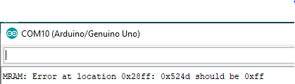

# MRAM Explore

This experiment series is the collection of experiments that explore the MRAM usage. Following section defines the experiments one by one. New contents will be added as the experiment progresses. The MRAM chip used for all of these experiments are [MRAM Click](https://download.mikroe.com/documents/datasheets/EST02896_MR25H256A_Datasheet_Rev1.0%20100116-1036068.pdf) which is sold on a nice interfacing circuit board at this [site](https://www.mikroe.com/mram-click). The chip is already equipped with SPI interfacing circuitary, making it compatible with all the microcontrollers available. Please find the codes for interfacing using ARDUINO at this github [link](https://github.com/prawarpoudel/spiMemoryChips).

The MRAM Chip comes with a really easy to use bed that can be mounted on the Arduino for interfacing. The following figures show our setup. Here we are not connecting to the bed, but rather we make an external connection so that we can play around with the connections.

 

## First Experiment

The first experiment that was performed was  just a simple traversing through the MRAM memory. The way how it operates is, it first writes 0x00 in entire memory of the MRAM, and reads the content of all the memory. While reading all the contents are checked with 0x00 to see if the writing operation was successful. Similar operation is done with writing 0xff to the memory locations well. If the content read from any memory location is not equal to either 0x00 in the first sequence of reading or 0xff in the second sequence of reading, it prints out message saying the content at certain location is not what it should be.

Following image shows the output on serial terminal when any read value is not what  it is supposed to be.

Following image shows the output printed in serial terminal when the operation is successful. The code can be found inside **expt1_18Dec/simpleTraverseMRAM**

## Second Experiment

We will continue with the same experimental code to explore the stability of the MRAM chip. Our goal is to induce perturbation in the memory cells. There have been previous experiments where researchers have controlled voltage pulses for inducing perturbation in MRAM memory cells [link](https://ieeexplore.ieee.org/stamp/stamp.jsp?tp=&arnumber=7047039&tag=1). We cannot go beyond the interfacing layer that is accessible to us, and we are in no way trying to go to physical layer, so the approach here would be to lower the voltage supply to our setup using an external DC Power Supply. 
